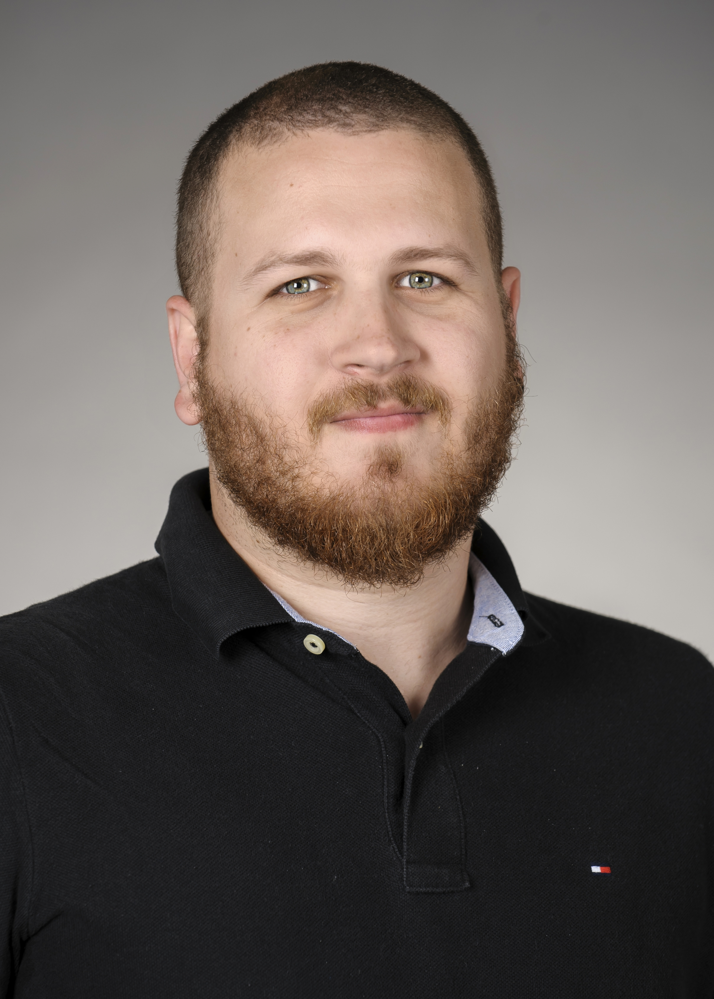
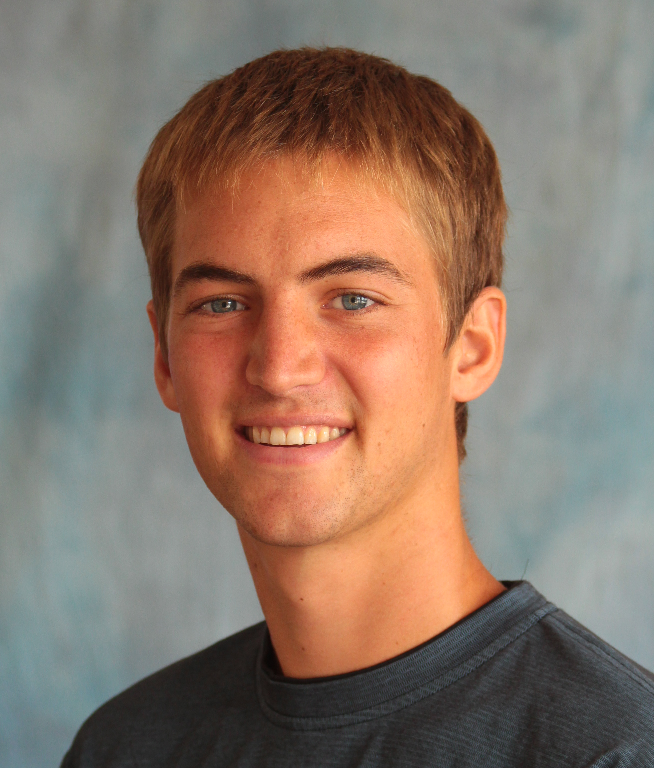

```{r knitr_init, echo=FALSE, cache=FALSE, warning=FALSE}
suppressPackageStartupMessages({
  library(knitr)
  library(rmdformats)
  })

## Global options
options(max.print="75")
opts_chunk$set(echo=FALSE,
               cache=TRUE,
               prompt=FALSE,
               tidy=TRUE,
               comment=NA,
               message=FALSE,
               warning=FALSE)
opts_knit$set(width=75)
```

___
<center>
  <div id="contentBox" style="margin:10px auto; width:100%">
  <a href="../" class="btn btn-primary">Home</a>    <a href="../project" class="btn btn-primary">The Project</a>  <a href="./" class="btn btn-primary">The Team</a>  <a href="../proposal.html" class="btn btn-primary">GP Proposal</a>
</div>
</center>
___

## Students

**Caio Faro** - *Project Manager*
  
<div id="contentBox" style="margin:10px auto; width:100%">
  <div id="column1" style="float:left; margin:0; width:35%">
  <center>
  
  <a href="resumes/caio.pdf" class="btn btn-primary">Resume</a>
  </center>
  </div>
  
Caio graduated in Rio de Janeiro (Brazil) in 2010 with a Bachelor and Licentiate degrees in Biological Sciences. In 2014 he also graduated from a   specialized graduate certification program in Environmental Management. From 2010 to 2015 he has worked as Field Researcher, Regional Coordinator and State Coordinator for the Rio de Janeiro’s Fisheries Monitoring Program at the Fisheries Institute Foundation of the State of Rio de Janeiro (FIPERJ). Additionally, since 2009 he has been volunteering with Sea Shepherd Conservation Society, mostly with environmental education. 

Caio is particularly interested in the conservation of sharks, rays and skates, as well other ecologically sensitive populations, through the adoption of sustainable fisheries practices. As a Latin American Fisheries Fellow at the Bren School, he is pursuing a specialization in Coastal Marine Resources Management.

</div>

___

**Juan Carlos Villasenor-Derbez** - *Data Manager*

<div id="contentBox" style="margin:10px auto; width:100%">
  <div id="column1" style="float:left; margin:0; width:35%">
  <center>
  
  <a href="resumes/jc.pdf" class="btn btn-primary">Resume</a>
  </center>
  </div>

Juan Carlos is a Mexican student that graduated with a B.Sc. in Oceanography from Universidad Autónoma de Baja California. Upon graduation, he worked as a field assistant for Comunidad y Biodiversidad. At the Bren School, Juan Carlos is pursuing a specialization in Coastal Marine Resources Management under the Latin American Fisheries Fellowship Program (LAFF).
  
Juan Carlos has a deep interest in understanding the implications of marine resource exploitation and management strategies, as well as addressing and communicating priority environmental and social issues and their possible solutions. Ecological modeling, marine reserve design, and fisheries management are among his main research interests. 

</div>

___
  
**Melaina Wright** - *Financial Manager*
<div id="contentBox" style="margin:10px auto; width:100%">
  <div id="column1" style="float:left; margin:0; width:35%">
  <center>
  
  <a href="resumes/melaina.pdf" class="btn btn-primary">Resume</a>
  </center>
  </div>

Melaina Wright graduated in 2015 from Wellesley College with a Bachelor of Arts in Biological Sciences and a minor in Environmental Studies. Under the direction of Dr. Koslow at Scripps Institution of Oceanography, she used multivariate statistics to determine the sampling requirements for creating a long-term ecological monitoring program for fish communities. At the Duke University Marine Lab, she determined if there are genetically distinct populations of shortfin mako sharks using RAD sequencing.

As a MESM student at the Bren School of Environmental Science & Management, Melaina is specializing in Coastal Marine Resources Management. Her main interest is in improving the ecological and socioeconomic sustainability of fisheries in the United States. 

</div>
  
**Jael Martinez** - *Outreach Manager*

<div id="contentBox" style="margin:10px auto; width:100%">
  <div id="column1" style="float:left; margin:0; width:35%">
  <center>
  
  <a href="resumes/jael.pdf" class="btn btn-primary">Resume</a>
  </center>
  </div>
  
Jael Martinez graduated in 2015 from Universidad San Francisco de Quito-Ecuador as a biologist with a minor in journalism. During her undergraduate she conducted a thesis in hematology to understand the health and human impacts on sea lions in San Cristobal Island. After her undergraduate studies she worked as a research lab technician at the Laboratory of Aquatic Ecology (LEA-USFQ) at Universidad San Francisco de Quito, there she worked with research projects that included taxonomy of freshwater insects and biomonitoring of freshwater and maintenance of ecological flows to help the conservation of rivers and integrated management of water resources in Ecuador.

Jael’s main interest focus on the dynamics of communities, citizen-based enforcement of environmental laws and how communication can improve environmental conditions. As a MESM student she is pursuing the Economics and Politics of the Environment specialization. 

</div>
___

## Advisors

**Chris Costello**

<div id="contentBox" style="margin:10px auto; width:100%">
  <div id="column1" style="float:left; margin:0; width:35%">
  <center>
  
  <a href="https://christopherjcostello.com/" class="btn btn-primary">Personal Webite</a>
  </center>
  </div>

Professor Chris Costello joined the faculty of University of California, Santa Barbara, after receiving his PhD in Agricultural and Natural Resource Economics from the University of California, Berkeley, in 2000. Outside of his appointment as a professor of Environmental and Resource Economics, he is an avid fisherman, diver and traveler. These hobbies frequently intersect or inspire his research concerning natural resource economics and policy on property rights.

In his work, Professor Costello combines theoretical micro-economics with modeling and empirical analysis, often to inform policy on fisheries management, biological diversity, introduced species, industrial regulation, or marine policy. He partners with colleagues from around the world to translate his research into on-the-ground action in a diverse spectrum of developed and developing countries, including Peru, Chile, Mexico, Cuba, Indonesia, China, the United States and Cambodia. 

</div>

___

## Client

**Comunidad y Biodiversidad A.C.**

  <div id="contentBox" style="margin:10px auto; width:100%">
  <div id="column1" style="float:left; margin:0; width:35%">
  <center>
  
  <a href="http://cobi.org.mx/en/" class="btn btn-primary">Website</a>
  </div>
  </center>
  
COBI is a non-profit organization dedicated to promoting the conservation of marine biodiversity in coastal communities of Mexico.

They work hand in hand with the communities to strengthen dialogue spaces and public participation in order to take decisions on how to manage the natural capital.

Together, they have established community marine reserves, which are the lungs of the ocean. We believe that with suitable sustainable models, conservation can be a profitable business for communities.

</div>

___


## PhD Advisor

**Sean Fitzgerald**

<div id="contentBox" style="margin:10px auto; width:100%">
  <div id="column1" style="float:left; margin:0; width:35%">
  <center>
  
  <a href="resumes/sean.pdf" class="btn btn-primary">Resume</a>
  </center>
  </div>

New fisheries develop and expand at rates that simply cannot be matched by research and data monitoring. Thus, most fisheries in the world are unassessed, unmanaged, and data-poor. I plan to research novel strategies for fisheries management that will allow fishermen to operate sustainably even when data is lacking. Recent studies have demonstrated positive results when adaptive frameworks are adopted that allow for spatial and temporal changes in fishing effort based on changes in population sizes and ecological impacts. New community-based, bottom-up (rather than top down) management strategies will allow for improved ecological health and socioeconomic well-being of local communities. 

</div>
___


