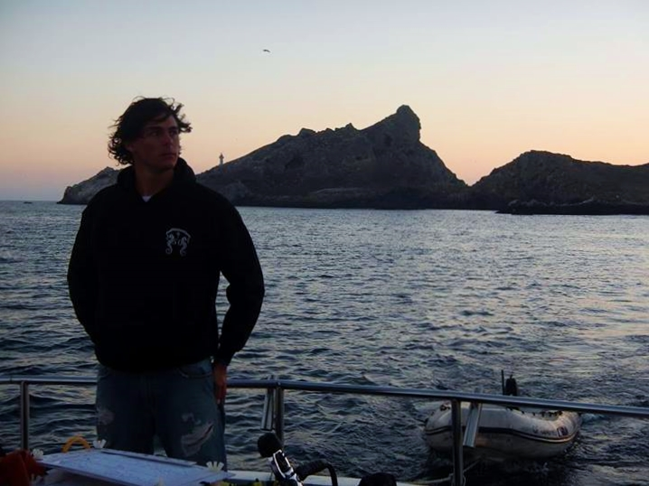

__________
<a href="../" class="btn btn-primary btn-sm">Home</a>
<a href="./" class="btn btn-primary btn-sm">The Team</a>
<a href="../proposal.html" class="btn btn-primary btn-sm">GP Proposal</a>

__________

<a href="./jc.pdf" class="btn btn-primary btn-sm">Resume</a>

____

Juan Carlos Villasenor-Derbez graduated from the *Universidad Autónoma de Baja California* (UABC), Mexico in 2015 with a Bachelor of Science in Oceanography. Prior to that program, he performed independent research on trophic ecology of the invasive lionfish at the Mexican Caribbean. Later, during his three and a half years as an undergrad student at UABC, Juan Carlos worked with the university’s Kelp Forest Ecology Group, where he studied fish assemblages associated with Kelp Forests along the Baja Peninsula.    

Upon graduation, he was hired as a consultant by the Mexican Tuna Seine Fleet in order to perform catch-data analysis. He also worked with the Mexican NGO [Comunidad y Biodiversidad](cobi.org.mx/en)(COBI; client for this project), as a Field Assistant, where he performed oceanographic and ecological monitoring in Marine Reserves voluntarily established by fishers along the Baja Peninsula.  

Juan Carlos has a deep interest in understanding the implications of marine resource exploitation and management strategies, as well as addressing and communicating priority environmental and social issues and their possible solutions. Ecological modeling, marine reserve design, and fisheries management are among his main research interests. At the Bren School, Juan Carlos is pursuing a specialization in **Coastal Marine Resources Management** under the Latin American Fisheries Fellowship Program.

